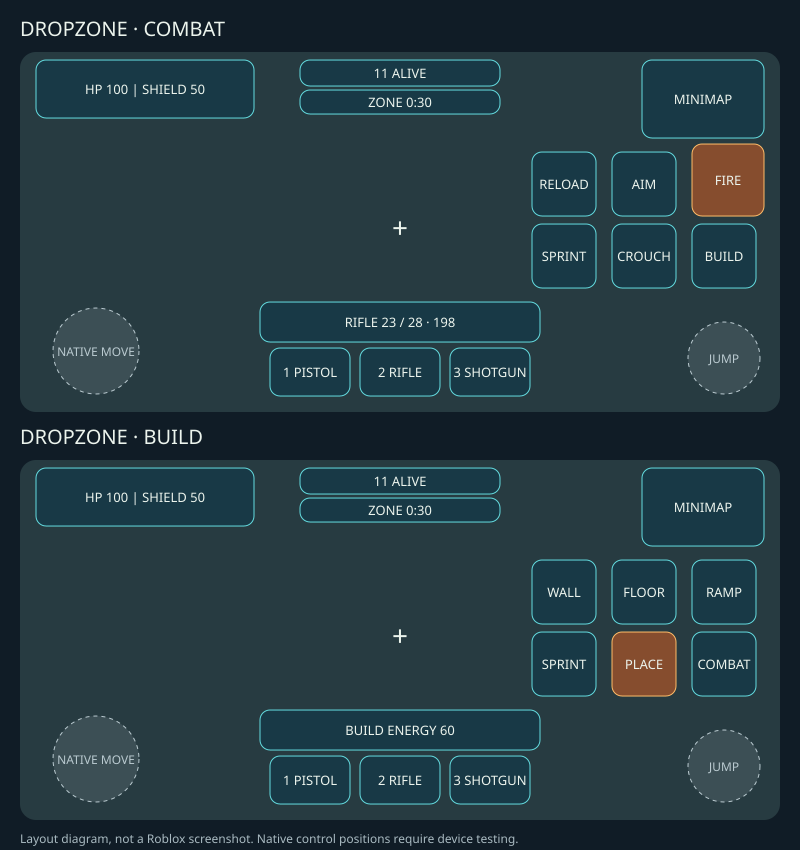

# スマホ戦闘・建築HUD

基準main: a9cf3995064565657b6994993c4d7f3aa5887563（2026-10-08）。
実装ブランチ: `feat/mobile-combat-build-hud`。

図はMobileLayoutの760×360安全領域を使用する配置プレビューで、Studioスクリーンショットではない。点線の標準スティック/Jumpは予約領域の例。実際の標準操作位置は端末で確認する。

## 操作

- 初期は戦闘。AIMは構えのトグル、FIREだけが射撃。FIRE保持中のドラッグ照準を維持。
- 建築で射撃・照準・装填・姿勢ボタンを収納し、壁/床/坂・設置・戦闘を表示。走る・標準移動/Jumpは両モードで使用可能。
- 壁/床/坂を選んだだけでは要求を送らない。設置だけが既存Build Actionを送り、Energy/配置/個数制限は既存サーバー処理が決める。
- 戦闘ボタンまたは武器スロットで戦闘へ復帰。モード切替で保持中の射撃/FireDrag/照準を解除し、復帰後は新しいFIRE操作が必要。
- 死亡・新ラウンド・キャラクター交換・フォーカス喪失で戦闘モードへリセット。
- HP/Shield・人数/Zone・ミニマップは上部、武器/弾薬とスロットは下部。建築Energyは建築中だけ弾薬表示の位置へ表示。
- CoreUISafeInsetsの領域内で端に配置。基準760×360より幅/高さがある場合はキャンバスを拡張。横画面640×320以上の検査では主要ボタンの一辺は48px以上。縦画面にも再配置するが、横画面を優先し縦画面の親指操作性は未確認。
- 標準スティック/Jumpを置換しない。右下120×120と左下180×120（論理座標）を予約。PC Q/Z/X/C/マウス/Shift/Ctrl/Space/数字キーは従来どおり。

## Studio / 実機確認（未実施）

1. PRブランチを取得して `rojo serve`、Studioの既存Rojo接続から同期。TownTemplates/WeaponModelsを保持し、端末エミュレーターで横画面の小型iPhone・ノッチ付きiPhone・タブレットを選ぶ。ウィンドウresize/縦横変更でも確認。
2. HP・弾薬・3スロットの欠け、ボタンの重なり、ノッチ/ホームインジケーターとの干渉を確認。標準スティックとJumpを同時操作し、予約領域より大きい標準操作UIが出る端末があれば機種/解像度を記録する。
3. AIMを10回切り替えて弾薬不変。移動+AIM+右画面ドラッグ、移動+AIM+FIREドラッグ、連射→離す→停止。肩越し・反動・クロスヘア・遮蔽・標準カメラとの二重回転なしを確認。
4. FIREを押したまま別の指で建築へ切替。射撃/照準が止まり、壁/床/坂の選択では弾薬とEnergy不変。設置で選択パーツのみ出る。重なり/上限/不足Energyで拒否され、Energyが不当に減らないこと。
5. 建築中の移動・視点・走る・標準Jump、戦闘復帰後の射撃/装填/武器切替/しゃがみ/走行中スライド。武器スロットからも戦闘復帰できること。
6. Draft自動表示中に3枚が読めて選択でき、パネル入力が射撃へ貫通せず、パネル外では移動/戦闘が続くこと。ダメージ数字・Hit Marker・Zone危険表示を確認。
7. 建築中の死亡→観戦→結果→次戦、途中参加、フォーカス解除、キャラクター交換を含む連続3試合。古い射撃/AIM/建築モードが残らないこと。
8. PCで3武器、左射撃/右Aim、R・数字キー、Q直接建築/Z/X/C選択、Shift/Ctrl/Space、V Draft、Tab観戦、BOT戦闘と2人以上の通信を回帰確認。

## 実施した検証

- `python3 tests/run.py`: PASS。全Lua構文、spawn 9710、gameplay 973、visual 824、client/server 271、adaptive layout 1032 assertionsと既存ソースガード。
- `python3 tests/preplay_analysis.py`: PASS。サーバーのゲームルール変更なし。
- `git diff --check`: PASS。Rojo構成・サーバー・Presentation・FireDrag・Raycast計算は変更なし。
- Studio描画、標準操作の実際の位置、フォント/アイコン、スマートフォンのマルチタッチ・FPS・通信は未確認。オフライン検査はこれらの代替ではない。
